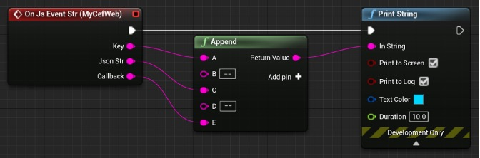
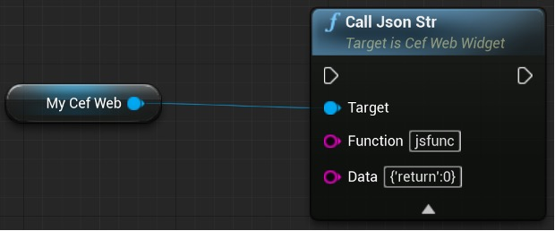

### JS 调用 UE

画布面板中选中 WebView Widget 部件。**Details**->**Events**绑定**On Js Event Str**事件。并实现该事件。如下图所示：



在 JS 脚本中引入 Resources/jsToUe.js 文件。

并调用 ue4，该函数类型如下：

`ue4(type,content,callback)`

Type: 为标识类型方便 ue 区分调用。

Content: js 传递给 ue 的参数，一般为 json 格式。便于多参数传递。

Callback: 当 UE 处理完毕后的异步回调函数

示例如下:

```
ue4("keyword", '{"url: "www.baidu.com"}', function(rv) => {
    alert(rv)
})
```

### UE 调用 JS

1. 在 Js 文件中注册 UE 调用函数

`ue.interface.jsfunc = function(content){}`

Jsfunc : 为函数名

Content: 接收 ue 的参数，一般为 json。

示例如下:

```
ue.interface.jsfunc = function(content){}
```

2. UE 发起调用



### JS 调试

开发过程中需要检测 js 页面的执行情况。需要使用 Js 调试功能。插件自身提供了 Js 调试功能，但没有调试界面，需要借助 Chrome 的调试界面。操作步骤如下:

1. 在项目命令行添加参数 `-cefdebug=18080`
2. 或者在 Game.ini 配置文件中增加如下内容

```
[WebView]
cefdebug=18080
```

3. 在 chrome 地址栏中输入 http://localhost:18080，在出来的页面中选择需要调试的 JS 页面。
